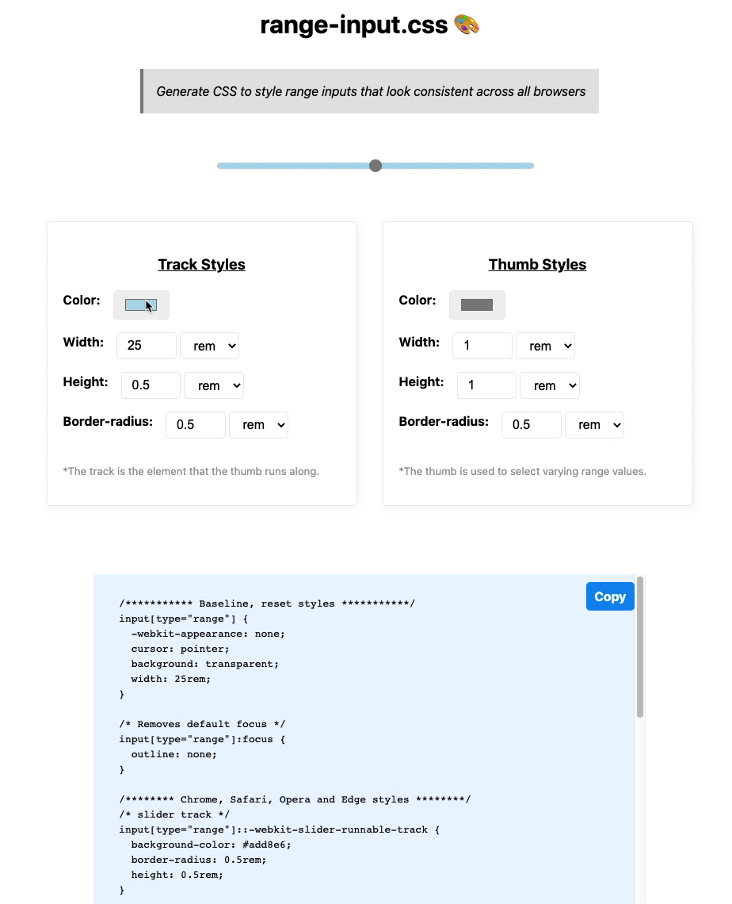

# range-input.css 🎨

<!-- PROJECT LOGO -->
 

  
  

  <strong> Generate CSS to style range inputs that look consistent across all browsers</strong>
     
     
    <a href="https://range-input-css.netlify.app/">View Demo 🏗️</a>
  

<!-- ABOUT THE PROJECT -->

## About this Project ✨

> Range inputs have notoriously been a pain to style. Each browser renders the input differently requiring you to use vendor prefixes in order to create a cohesive look and feel. To speed up the process, I created this tool to make it easier for you to create custom range inputs that will look awesome and consistent across all browsers!

### Built With 🛠️

- Plain ol' HTML, CSS, and JS
- [MVP.css](https://andybrewer.github.io/mvp/) - Minimalist stylesheet for HTML elements

<!-- CONTRIBUTING -->

## Contributing

1. Fork the Project
2. Create your Feature Branch (`git checkout -b feature/AmazingFeature`)
3. Commit your Changes (`git commit -m 'Add some AmazingFeature'`)
4. Push to the Branch (`git push origin feature/AmazingFeature`)
5. Open a Pull Request

<!-- LICENSE -->

## License

Distributed under the MIT License. See `LICENSE` for more information.

<!-- CONTACT -->

## Contact

Alyssa Holland - [@Code_Runnings](https://twitter.com/your_username) - HeyAHolland@gmail.com

Project Link: [https://github.com/Cool-Runningz/range-input.css](https://github.com/Cool-Runningz/range-input.css)
